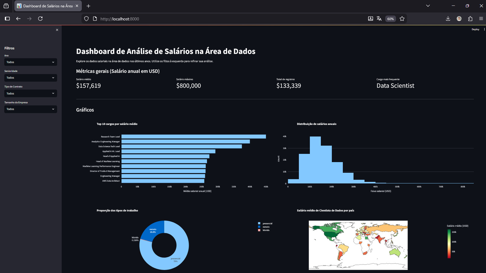
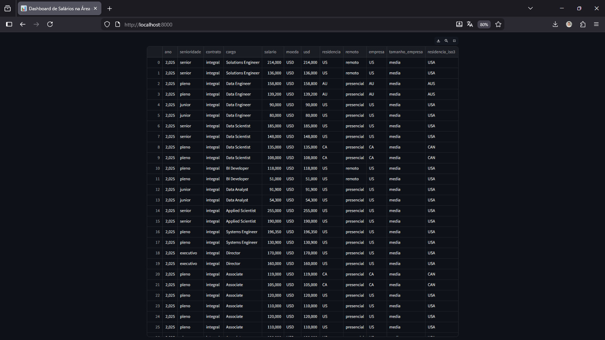

# Dashboard de Salários na Área de Dados

Uma aplicação web interativa para análise e visualização de dados salariais na área de dados.


## 🛠️ Tecnologias Utilizadas

Projeto de visualização e análise de dados salariais na área de dados. Este dashboard foi desenvolvido como parte da **Imersão de Dados com Python** da Alura com algumas implementações de pipeline CI/CD com Docker-compose e GitHub Actions.

Principais funcionalidades:
- Filtros interativos por ano, senioridade, tipo de contrato e tamanho da empresa
- KPIs (salário médio, salário máximo, total de registros, cargo mais frequente)
- Gráficos interativos com Plotly (barras, histograma, pizza e mapa coroplético)
- Tabela de dados filtrados para consulta detalhada

Tecnologias utilizadas
- Python
- Streamlit
- Pandas
- Plotly

### 📸 Visualização do Dashboard (Streamlit)



*Graph View mostrando avisualização de dados salariais na área de dados.*



*Planilha consolidada mostrando os dados como um todo.*

Como executar

### Opção 1: Local (Desenvolvimento)

1. Crie e ative um ambiente virtual:

```bash
python -m venv venv
# Windows PowerShell
venv\Scripts\Activate.ps1
# ou cmd
venv\Scripts\activate.bat
```

2. Instale dependências:

```bash
pip install -r requirements.txt
```

3. Execute o app (opções):

- Recomendada (scripts locais):

	- PowerShell (Windows):

		```powershell
		.\run_local.ps1
		```

	- Bash (Linux / macOS):

		```bash
		./run_local.sh
		```

	Esses scripts predefinem `STREAMLIT_SERVER_PORT=5000` e `STREAMLIT_SERVER_ADDRESS=localhost` para execução local.

- Usando o CLI do Streamlit com `PYTHONPATH` (garante que `src` esteja no caminho de import):

	- Linux / macOS:

		```bash
		PYTHONPATH=. streamlit run src/app.py
		```

	- Windows PowerShell:

		```powershell
		$env:PYTHONPATH = "."; streamlit run src/app.py
		```

- Alternativa com o módulo do Python:

	```bash
	python -m streamlit run src/app.py
	```

A aplicação estará acessível em `http://localhost:5000` quando executada pelos scripts locais, ou na porta configurada pelo ambiente (ver `docker/Dockerfile` e `docker-compose.yml` para configuração Docker).

### Opção 2: Docker (Produção / CI-CD)

Tenha o Docker e Docker Compose instalados. Após clonar o repositório:

```bash
docker-compose up --build
```

A aplicação será automaticamente iniciada e estará acessível em `http://localhost:8000`

Para parar o container:

```bash
docker-compose down
```

Estrutura do projeto (resumida)
```
Dashboard_salarios_dt/
├── src/
│   ├── __init__.py
│   ├── app.py                 — entrada principal da aplicação
│   ├── config.py              — constantes e configurações
│   ├── data_loader.py         — carregamento e cache dos dados
│   ├── filters.py             — lógica de filtros
│   ├── metrics.py             — cálculo de métricas (KPIs)
│   └── charts.py              — funções de gráficos
├── docker/
│   ├── Dockerfile             — imagem Docker otimizada multi-stage
│   └── .dockerignore          — arquivos ignorados no build
├── .streamlit/
│   └── config.toml            — configurações do Streamlit
├── .github/
│   └── workflows/
│       └── build-and-publish.yml — pipeline CI/CD (GitHub Actions)
├── requirements.txt           — dependências do projeto
├── readme.md                  — este arquivo
├── .gitignore                 — arquivos ignorados pelo Git
└── docker-compose.yml         — orquestração do container
```

Créditos
- Desenvolvido por: Mathews Moura através da Imersão de Dados com Python da Alura
- Site Alura: https://www.alura.com.br/
- GitHub: https://github.com/Mathewsmoura
- LinkedIn: https://www.linkedin.com/in/mathews-moura/

Licença
- Este repositório contém material criado como parte da Imersão de Dados com Python (Alura). Sinta-se livre para usar e adaptar o código para fins educacionais.

---

- **Pandas** (>=1.5, <3.0) - Manipulação e análise de dados
- **Streamlit** (>=1.20, <2.0) - Framework para criação de aplicações web
- **Plotly** (>=5.0, <6.0) - Visualizações interativas